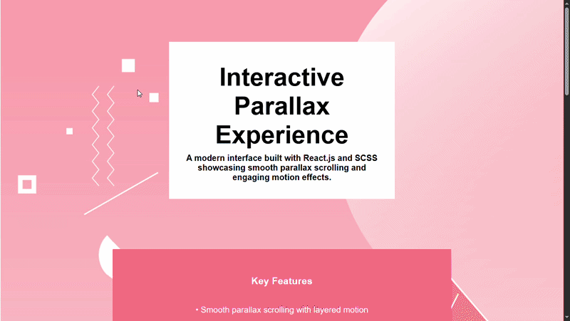

# 🌄 Interactive Parallax Website (React + SCSS)

## 📌 Overview
This project is an interactive parallax scrolling website built using React.js and SCSS. It demonstrates how layered motion, scroll-based effects, and structured UI design can create an engaging and modern user experience.

---

## 🎯 Features
- Smooth parallax scrolling with layered backgrounds  
- Scroll progress indicator  
- Scroll-to-top button with smooth behavior  
- Fade-in animations using Intersection Observer  
- Responsive and clean UI layout  
- Component-based architecture  

---

## 🧠 Key Concepts Used
- Scroll event handling  
- DOM manipulation  
- Intersection Observer API  
- React Hooks (useState, useEffect)  
- UI/UX design principles  

---

## 🛠 Tech Stack
- React.js  
- JavaScript  
- SCSS (SASS)  

---

## 📂 Project Structure
src/
├── App.js
├── App.scss
├── assets/

---

## 🚀 How It Works
- Background layers move at different speeds to create depth  
- Scroll events dynamically update UI elements like progress bar  
- Sections animate into view using fade-in effects  
- UI responds smoothly to user interactions  

---

## 🎥 Demo

---

## ⚠️ Limitations
- No backend integration  
- Static content  
- No API usage  

---

## 🚀 Future Improvements
- Add navigation bar with section scrolling  
- Integrate dynamic content (API-based)  
- Improve animations using libraries (e.g., Framer Motion)  
- Enhance mobile responsiveness  

---

## ⭐ Conclusion
This project demonstrates how modern frontend techniques can be used to build visually engaging and interactive web interfaces using React and SCSS.
